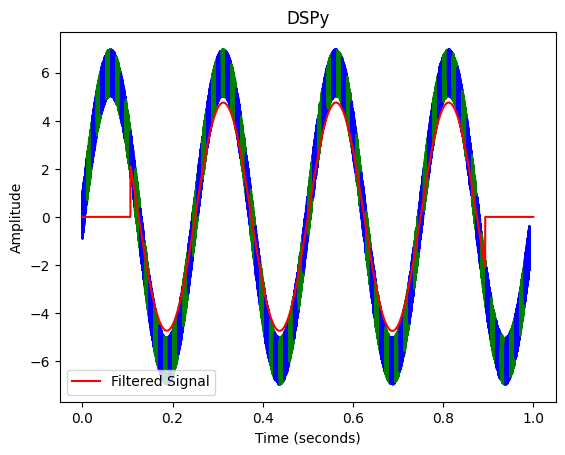
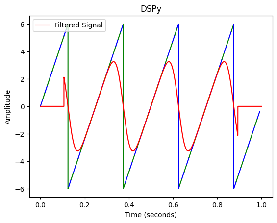

# DSPy

A Python-based educational playground for creating, exploring, and visualizing digital signal processing (DSP) algorithms using NumPy, Matplotlib and Jupyter Notebook.  
Perfect for interactive learning and experimentation with DSP concepts.

   
  

## Contribution
Contributors are welcomed to this open-source project. Any feedback or assistance, whether in coding, packaging, documentation, design, or testing, is greatly appreciated. 

## License
This work is licensed under the [SPDX-License-Identifier: GPL-2.0-only](./LICENSE).
